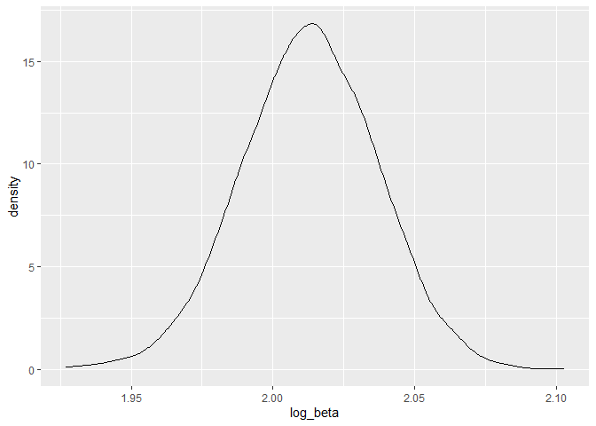
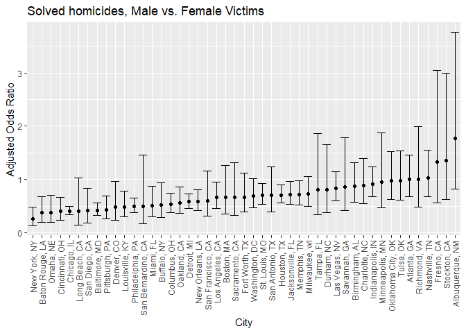
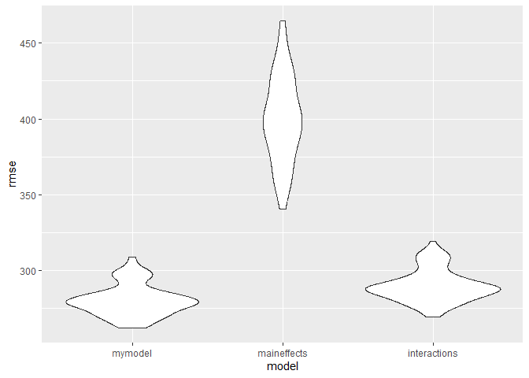
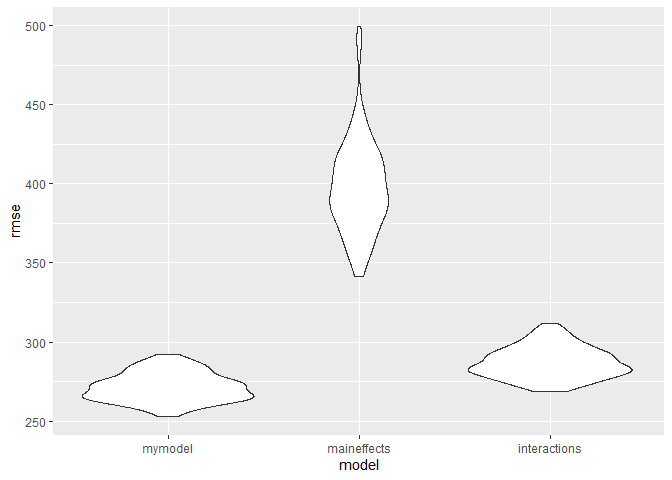

Homework 6
================
Mari Sanders
2024-12-01

# Problem 1

``` r
weather_df = 
  rnoaa::meteo_pull_monitors(
    c("USW00094728"),
    var = c("PRCP", "TMIN", "TMAX"), 
    date_min = "2017-01-01",
    date_max = "2017-12-31") %>%
  mutate(
    name = recode(id, USW00094728 = "CentralPark_NY"),
    tmin = tmin / 10,
    tmax = tmax / 10) %>%
  select(name, id, everything())
```

    ## using cached file: C:\Users\marsi\AppData\Local/R/cache/R/rnoaa/noaa_ghcnd/USW00094728.dly

    ## date created (size, mb): 2024-09-26 10:18:58.392981 (8.668)

    ## file min/max dates: 1869-01-01 / 2024-09-30

``` r
boots <- 
  weather_df %>% 
  bootstrap(n = 5000) %>% 
  mutate(
    models = map(strap, ~lm(tmax~tmin, data = .)), 
    results = map(models, broom::tidy)
  )
```

``` r
log_beta <- boots %>% 
  select(.id, results) %>% 
  unnest(results) %>% 
  select(.id, term, estimate) %>% 
  pivot_wider(
    names_from = "term", 
    values_from = "estimate"
  ) %>% 
  rename(beta0 = "(Intercept)", beta1 = "tmin") %>% 
  mutate(log_beta = log(beta0*beta1)) 

log_beta %>% 
  ggplot(aes(x = log_beta)) + 
  geom_density()
```

<!-- -->

# Problem 2

Data Cleaning

``` r
homicide_df <- read_csv("data/homicide-data.csv", na = c("", "NA", "Unknown")) %>% filter(victim_race != "NA") %>% 
  janitor::clean_names() %>% 
  unite(city_state, c(city, state), sep = ", ") %>% 
  filter(city_state != "Dallas, TX", 
         city_state != "Phoenix, AZ", 
         city_state != "Kansas City, MO", 
         city_state != "Tulsa, AL",
         victim_race %in% c("White", "Black"),
         victim_age != "Unknown"
  ) %>%
  mutate(victim_age = as.numeric(victim_age), 
           resolved = as.numeric(disposition == "Closed by arrest"), 
        victim_race = fct_relevel(victim_race, "White")) %>% 
  select(city_state, resolved, victim_age, victim_race, victim_sex) 
```

    ## Rows: 52179 Columns: 12
    ## ── Column specification ────────────────────────────────────────────────────────
    ## Delimiter: ","
    ## chr (8): uid, victim_last, victim_first, victim_race, victim_sex, city, stat...
    ## dbl (4): reported_date, victim_age, lat, lon
    ## 
    ## ℹ Use `spec()` to retrieve the full column specification for this data.
    ## ℹ Specify the column types or set `show_col_types = FALSE` to quiet this message.

Baltimore

``` r
logistic <- 
  homicide_df %>% 
  filter(city_state == "Baltimore, MD") %>% 
  glm(resolved ~ victim_age + victim_sex + victim_race, data = ., family = binomial())

broom::tidy(logistic, conf.int = TRUE) %>% mutate(OR = exp(estimate), 
                                                  conf_low = exp(conf.low), 
                                                  conf_high = exp(conf.high)) %>% 
  select(term, log_OR = estimate, OR, conf_low, conf_high) %>% filter(term == "victim_sexMale") %>% 
  knitr::kable(digits = 3)
```

| term           | log_OR |    OR | conf_low | conf_high |
|:---------------|-------:|------:|---------:|----------:|
| victim_sexMale | -0.854 | 0.426 |    0.324 |     0.558 |

In Baltimore, homicides of Male victims were 0.426 times more likely to
be unsolved compared to homicides of Female victims after adjusting for
all other variables.

``` r
city_results <- homicide_df %>%
  group_by(city_state) %>%
  nest() %>%
  mutate(
    model = map(data, ~glm(resolved ~ victim_age + victim_sex + victim_race, data = ., family = "binomial")),
    results = map(model, broom::tidy, conf.int = TRUE)) %>%
  unnest(results) %>%
  mutate(OR = exp(estimate), 
         conf_low = exp(conf.low), 
                                                  conf_high = exp(conf.high)) %>% 
  select(city_state, term, OR, conf_low, conf_high) %>%
   filter(term == "victim_sexMale") 

city_results %>% knitr::kable(digits = 3)
```

| city_state         | term           |    OR | conf_low | conf_high |
|:-------------------|:---------------|------:|---------:|----------:|
| Albuquerque, NM    | victim_sexMale | 1.767 |    0.825 |     3.762 |
| Atlanta, GA        | victim_sexMale | 1.000 |    0.680 |     1.458 |
| Baltimore, MD      | victim_sexMale | 0.426 |    0.324 |     0.558 |
| Baton Rouge, LA    | victim_sexMale | 0.381 |    0.204 |     0.684 |
| Birmingham, AL     | victim_sexMale | 0.870 |    0.571 |     1.314 |
| Boston, MA         | victim_sexMale | 0.667 |    0.351 |     1.260 |
| Buffalo, NY        | victim_sexMale | 0.521 |    0.288 |     0.936 |
| Charlotte, NC      | victim_sexMale | 0.884 |    0.551 |     1.391 |
| Chicago, IL        | victim_sexMale | 0.410 |    0.336 |     0.501 |
| Cincinnati, OH     | victim_sexMale | 0.400 |    0.231 |     0.667 |
| Columbus, OH       | victim_sexMale | 0.532 |    0.377 |     0.748 |
| Denver, CO         | victim_sexMale | 0.479 |    0.233 |     0.962 |
| Detroit, MI        | victim_sexMale | 0.582 |    0.462 |     0.734 |
| Durham, NC         | victim_sexMale | 0.812 |    0.382 |     1.658 |
| Fort Worth, TX     | victim_sexMale | 0.669 |    0.394 |     1.121 |
| Fresno, CA         | victim_sexMale | 1.335 |    0.567 |     3.048 |
| Houston, TX        | victim_sexMale | 0.711 |    0.557 |     0.906 |
| Indianapolis, IN   | victim_sexMale | 0.919 |    0.678 |     1.241 |
| Jacksonville, FL   | victim_sexMale | 0.720 |    0.536 |     0.965 |
| Las Vegas, NV      | victim_sexMale | 0.837 |    0.606 |     1.151 |
| Long Beach, CA     | victim_sexMale | 0.410 |    0.143 |     1.024 |
| Los Angeles, CA    | victim_sexMale | 0.662 |    0.457 |     0.954 |
| Louisville, KY     | victim_sexMale | 0.491 |    0.301 |     0.784 |
| Memphis, TN        | victim_sexMale | 0.723 |    0.526 |     0.984 |
| Miami, FL          | victim_sexMale | 0.515 |    0.304 |     0.873 |
| Milwaukee, wI      | victim_sexMale | 0.727 |    0.495 |     1.054 |
| Minneapolis, MN    | victim_sexMale | 0.947 |    0.476 |     1.881 |
| Nashville, TN      | victim_sexMale | 1.034 |    0.681 |     1.556 |
| New Orleans, LA    | victim_sexMale | 0.585 |    0.422 |     0.812 |
| New York, NY       | victim_sexMale | 0.262 |    0.133 |     0.485 |
| Oakland, CA        | victim_sexMale | 0.563 |    0.364 |     0.867 |
| Oklahoma City, OK  | victim_sexMale | 0.974 |    0.623 |     1.520 |
| Omaha, NE          | victim_sexMale | 0.382 |    0.199 |     0.711 |
| Philadelphia, PA   | victim_sexMale | 0.496 |    0.376 |     0.650 |
| Pittsburgh, PA     | victim_sexMale | 0.431 |    0.263 |     0.696 |
| Richmond, VA       | victim_sexMale | 1.006 |    0.483 |     1.994 |
| San Antonio, TX    | victim_sexMale | 0.705 |    0.393 |     1.238 |
| Sacramento, CA     | victim_sexMale | 0.669 |    0.326 |     1.314 |
| Savannah, GA       | victim_sexMale | 0.867 |    0.419 |     1.780 |
| San Bernardino, CA | victim_sexMale | 0.500 |    0.166 |     1.462 |
| San Diego, CA      | victim_sexMale | 0.413 |    0.191 |     0.830 |
| San Francisco, CA  | victim_sexMale | 0.608 |    0.312 |     1.155 |
| St. Louis, MO      | victim_sexMale | 0.703 |    0.530 |     0.932 |
| Stockton, CA       | victim_sexMale | 1.352 |    0.626 |     2.994 |
| Tampa, FL          | victim_sexMale | 0.808 |    0.340 |     1.860 |
| Tulsa, OK          | victim_sexMale | 0.976 |    0.609 |     1.544 |
| Washington, DC     | victim_sexMale | 0.691 |    0.466 |     1.014 |

``` r
city_results %>% 
  ggplot(aes(x = fct_reorder(city_state, OR), y = OR)) + 
  geom_point() +
  geom_errorbar(aes(ymin = conf_low, ymax = conf_high)) +
  labs(
    title = "Unsolved homicides, Male vs. Female Victims",
    x = "City", 
    y = "Adjusted Odds Ratio"
  ) +
  theme(axis.text.x = element_text(angle = 90, vjust = 0.5, hjust = 1))
```

<!-- -->

# Problem 3

``` r
birthweight <- read_csv("data/birthweight.csv") %>% 
  mutate(babysex = as.factor(babysex), 
         frace = as.factor(frace), 
         mrace = as.factor(mrace), 
         malform = as.factor(malform))
```

    ## Rows: 4342 Columns: 20
    ## ── Column specification ────────────────────────────────────────────────────────
    ## Delimiter: ","
    ## dbl (20): babysex, bhead, blength, bwt, delwt, fincome, frace, gaweeks, malf...
    ## 
    ## ℹ Use `spec()` to retrieve the full column specification for this data.
    ## ℹ Specify the column types or set `show_col_types = FALSE` to quiet this message.

``` r
birthweight %>% 
  is.na() %>% 
  summary()
```

    ##   babysex          bhead          blength           bwt         
    ##  Mode :logical   Mode :logical   Mode :logical   Mode :logical  
    ##  FALSE:4342      FALSE:4342      FALSE:4342      FALSE:4342     
    ##    delwt          fincome          frace          gaweeks       
    ##  Mode :logical   Mode :logical   Mode :logical   Mode :logical  
    ##  FALSE:4342      FALSE:4342      FALSE:4342      FALSE:4342     
    ##   malform         menarche        mheight          momage       
    ##  Mode :logical   Mode :logical   Mode :logical   Mode :logical  
    ##  FALSE:4342      FALSE:4342      FALSE:4342      FALSE:4342     
    ##    mrace           parity         pnumlbw         pnumsga       
    ##  Mode :logical   Mode :logical   Mode :logical   Mode :logical  
    ##  FALSE:4342      FALSE:4342      FALSE:4342      FALSE:4342     
    ##    ppbmi            ppwt           smoken          wtgain       
    ##  Mode :logical   Mode :logical   Mode :logical   Mode :logical  
    ##  FALSE:4342      FALSE:4342      FALSE:4342      FALSE:4342

There are no missing values in this dataset.

``` r
birthweight_model <- 
  lm(bwt ~ ., data = birthweight)
summary(birthweight_model)
```

    ## 
    ## Call:
    ## lm(formula = bwt ~ ., data = birthweight)
    ## 
    ## Residuals:
    ##      Min       1Q   Median       3Q      Max 
    ## -1097.68  -184.86    -3.33   173.09  2344.15 
    ## 
    ## Coefficients: (3 not defined because of singularities)
    ##               Estimate Std. Error t value Pr(>|t|)    
    ## (Intercept) -6265.3914   660.4011  -9.487  < 2e-16 ***
    ## babysex2       28.7073     8.4652   3.391 0.000702 ***
    ## bhead         130.7781     3.4523  37.881  < 2e-16 ***
    ## blength        74.9536     2.0217  37.075  < 2e-16 ***
    ## delwt           4.1007     0.3948  10.386  < 2e-16 ***
    ## fincome         0.2898     0.1795   1.614 0.106551    
    ## frace2         14.3313    46.1501   0.311 0.756168    
    ## frace3         21.2361    69.2960   0.306 0.759273    
    ## frace4        -46.9962    44.6782  -1.052 0.292912    
    ## frace8          4.2969    74.0741   0.058 0.953745    
    ## gaweeks        11.5494     1.4654   7.882 4.06e-15 ***
    ## malform1        9.7650    70.6259   0.138 0.890039    
    ## menarche       -3.5508     2.8951  -1.226 0.220083    
    ## mheight         9.7874    10.3116   0.949 0.342588    
    ## momage          0.7593     1.2221   0.621 0.534418    
    ## mrace2       -151.4354    46.0453  -3.289 0.001014 ** 
    ## mrace3        -91.3866    71.9190  -1.271 0.203908    
    ## mrace4        -56.4787    45.1369  -1.251 0.210901    
    ## parity         95.5411    40.4793   2.360 0.018307 *  
    ## pnumlbw             NA         NA      NA       NA    
    ## pnumsga             NA         NA      NA       NA    
    ## ppbmi           4.3538    14.8913   0.292 0.770017    
    ## ppwt           -3.4716     2.6121  -1.329 0.183913    
    ## smoken         -4.8544     0.5871  -8.269  < 2e-16 ***
    ## wtgain              NA         NA      NA       NA    
    ## ---
    ## Signif. codes:  0 '***' 0.001 '**' 0.01 '*' 0.05 '.' 0.1 ' ' 1
    ## 
    ## Residual standard error: 272.5 on 4320 degrees of freedom
    ## Multiple R-squared:  0.7183, Adjusted R-squared:  0.717 
    ## F-statistic: 524.6 on 21 and 4320 DF,  p-value: < 2.2e-16

Since `babysex2`, `bhead`, `blength`, `delwt`, `gaweeks`, `mrace`,
`mrace2`, `parity` and `smoken` are all significant, i am going to
examine what the adjusted $r^2$ looks like

``` r
birthweight_model_adjusted <- 
  lm(bwt~ babysex + bhead + blength + delwt + gaweeks + mrace + parity + smoken, data = birthweight)
summary(birthweight_model_adjusted)
```

    ## 
    ## Call:
    ## lm(formula = bwt ~ babysex + bhead + blength + delwt + gaweeks + 
    ##     mrace + parity + smoken, data = birthweight)
    ## 
    ## Residuals:
    ##      Min       1Q   Median       3Q      Max 
    ## -1119.67  -181.24    -5.87   173.51  2340.76 
    ## 
    ## Coefficients:
    ##               Estimate Std. Error t value Pr(>|t|)    
    ## (Intercept) -5822.5934    98.8325 -58.914  < 2e-16 ***
    ## babysex2       28.6609     8.4951   3.374 0.000748 ***
    ## bhead         131.6982     3.4607  38.056  < 2e-16 ***
    ## blength        75.8653     2.0210  37.538  < 2e-16 ***
    ## delwt           2.2649     0.1961  11.550  < 2e-16 ***
    ## gaweeks        12.1400     1.4654   8.284  < 2e-16 ***
    ## mrace2       -146.7893     9.2435 -15.880  < 2e-16 ***
    ## mrace3        -71.5880    42.4809  -1.685 0.092026 .  
    ## mrace4       -119.5979    18.7656  -6.373 2.04e-10 ***
    ## parity         98.6113    40.5334   2.433 0.015021 *  
    ## smoken         -4.7472     0.5882  -8.071 8.96e-16 ***
    ## ---
    ## Signif. codes:  0 '***' 0.001 '**' 0.01 '*' 0.05 '.' 0.1 ' ' 1
    ## 
    ## Residual standard error: 273.8 on 4331 degrees of freedom
    ## Multiple R-squared:  0.7148, Adjusted R-squared:  0.7142 
    ## F-statistic:  1086 on 10 and 4331 DF,  p-value: < 2.2e-16

``` r
birthweight %>%
  add_predictions(birthweight_model_adjusted) %>%
  add_residuals(birthweight_model_adjusted) %>% 
  ggplot(aes(x = pred, y = resid)) + 
  geom_point() 
```

<!-- -->

``` r
main_effects <- 
  lm(bwt ~ blength + gaweeks, data = birthweight)

interactions <- 
  lm(bwt ~bhead + blength + babysex + bhead*blength*babysex, data = birthweight)
```

``` r
cv_df <- 
  crossv_mc(birthweight, 100) %>% 
  mutate(
    train = map(train, as_tibble), 
    test = map(test, as_tibble)
  ) %>% 
  mutate(my_model = map(train, \(df) lm(bwt~ babysex + bhead + blength + delwt + gaweeks + mrace + parity + smoken, data = df)),
    main_effects = map(train, \(df) lm(bwt ~ blength, gaweeks, data = df)), 
         interactions = map(train, \(df) lm(bwt ~bhead + blength + babysex + bhead*blength*babysex, data = df))) %>% 
  mutate(
    rmse_mymodel = map2_dbl(my_model, test, \(mod, df) rmse(model = mod, data = df)), 
    rmse_maineffects = map2_dbl(main_effects, test, \(mod, df) rmse(model = mod, data = df)), 
    rmse_interactions = map2_dbl(interactions, test, \(mod, df) rmse(model = mod, data = df))
  )
```

    ## Warning: There were 2 warnings in `mutate()`.
    ## The first warning was:
    ## ℹ In argument: `rmse_mymodel = map2_dbl(...)`.
    ## Caused by warning in `predict.lm()`:
    ## ! prediction from rank-deficient fit; attr(*, "non-estim") has doubtful cases
    ## ℹ Run `dplyr::last_dplyr_warnings()` to see the 1 remaining warning.

``` r
cv_df %>% 
  select(starts_with("rmse")) %>% 
  pivot_longer(everything(), 
               names_to = "model", 
               values_to = "rmse", 
               names_prefix = "rmse_") %>% 
  mutate(model = fct_inorder(model)) %>% 
  ggplot(aes(x = model, y = rmse)) +
  geom_violin()
```

<!-- -->
