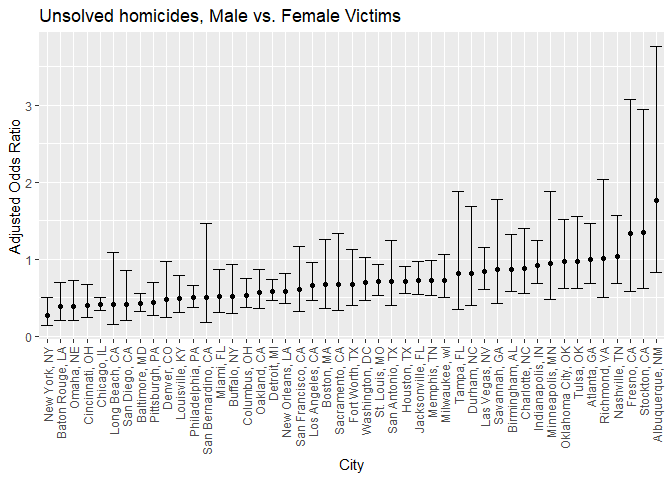

Homework 6
================
Mari Sanders
2024-11-17

# Problem 1

``` r
weather_df = 
  rnoaa::meteo_pull_monitors(
    c("USW00094728"),
    var = c("PRCP", "TMIN", "TMAX"), 
    date_min = "2017-01-01",
    date_max = "2017-12-31") %>%
  mutate(
    name = recode(id, USW00094728 = "CentralPark_NY"),
    tmin = tmin / 10,
    tmax = tmax / 10) %>%
  select(name, id, everything())
```

    ## using cached file: C:\Users\marsi\AppData\Local/R/cache/R/rnoaa/noaa_ghcnd/USW00094728.dly

    ## date created (size, mb): 2024-09-26 10:18:58.392981 (8.668)

    ## file min/max dates: 1869-01-01 / 2024-09-30

# Problem 2

Data Cleaning

``` r
homicide_df <- read_csv("data/homicide-data.csv") %>% 
  janitor::clean_names() %>% 
  unite(city_state, c(city, state), sep = ", ") %>% 
  filter(city_state != "Dallas, TX", 
         city_state != "Phoenix, AZ", 
         city_state != "Kansas City, MO", 
         city_state != "Tulsa, AL",
         victim_race %in% c("White", "Black"),
         victim_age != "Unknown"
  ) %>%
  mutate(victim_age = as.numeric(victim_age)) %>% 
  mutate(resolved = as.numeric(disposition == "Closed by arrest"), 
         victim_race = fct_relevel(victim_race, "White"),  ) %>% 
  select(city_state, resolved, victim_age, victim_race, victim_sex) 
```

    ## Rows: 52179 Columns: 12
    ## ── Column specification ────────────────────────────────────────────────────────
    ## Delimiter: ","
    ## chr (9): uid, victim_last, victim_first, victim_race, victim_age, victim_sex...
    ## dbl (3): reported_date, lat, lon
    ## 
    ## ℹ Use `spec()` to retrieve the full column specification for this data.
    ## ℹ Specify the column types or set `show_col_types = FALSE` to quiet this message.

Baltimore

``` r
logistic <- 
  homicide_df %>% 
  filter(city_state == "Baltimore, MD") %>% 
  glm(resolved ~ victim_age + victim_sex + victim_race, data = ., family = binomial())

broom::tidy(logistic, conf.int = TRUE) %>% mutate(OR = exp(estimate)) %>% 
  select(term, log_OR = estimate, OR, conf.low, conf.high) 
```

    ## # A tibble: 4 × 5
    ##   term               log_OR    OR conf.low conf.high
    ##   <chr>               <dbl> <dbl>    <dbl>     <dbl>
    ## 1 (Intercept)       1.15    3.16    0.692   1.62    
    ## 2 victim_age       -0.00673 0.993  -0.0133 -0.000246
    ## 3 victim_sexMale   -0.854   0.426  -1.13   -0.584   
    ## 4 victim_raceBlack -0.842   0.431  -1.19   -0.501

``` r
city_results <- homicide_df %>%
  group_by(city_state) %>%
  nest() %>%
  mutate(
    model = map(data, \(x) glm(resolved ~ victim_age + victim_sex + victim_race, data = x, family = "binomial")),
    results = map(model, \(x) broom::tidy(x, exponentiate = TRUE, conf.int = TRUE))
  ) %>%
  unnest(results) %>%
  filter(term == "victim_sexMale") %>%
  select(city_state, estimate, conf.low, conf.high) %>%
  arrange(estimate) 
```

    ## Warning: There were 45 warnings in `mutate()`.
    ## The first warning was:
    ## ℹ In argument: `results = map(model, function(x) broom::tidy(x, exponentiate =
    ##   TRUE, conf.int = TRUE))`.
    ## ℹ In group 1: `city_state = "Albuquerque, NM"`.
    ## Caused by warning:
    ## ! glm.fit: fitted probabilities numerically 0 or 1 occurred
    ## ℹ Run `dplyr::last_dplyr_warnings()` to see the 44 remaining warnings.

``` r
city_results %>% 
  ggplot(aes(x =  reorder(city_state, estimate), y = estimate)) + 
  geom_point() +
  geom_errorbar(aes(ymin = conf.low, ymax = conf.high)) +
  theme(axis.text.x = element_text(angle = 90, vjust = 0.5, hjust = 1))
```

<!-- -->

# Problem 3

``` r
birthweight <- read_csv("data/birthweight.csv") %>% 
  mutate(babysex = as.factor(babysex), 
         frace = as.factor(frace), 
         mrace = as.factor(mrace), 
         malform = as.factor(malform))
```

    ## Rows: 4342 Columns: 20
    ## ── Column specification ────────────────────────────────────────────────────────
    ## Delimiter: ","
    ## dbl (20): babysex, bhead, blength, bwt, delwt, fincome, frace, gaweeks, malf...
    ## 
    ## ℹ Use `spec()` to retrieve the full column specification for this data.
    ## ℹ Specify the column types or set `show_col_types = FALSE` to quiet this message.

``` r
colSums(is.na(birthweight))
```

    ##  babysex    bhead  blength      bwt    delwt  fincome    frace  gaweeks 
    ##        0        0        0        0        0        0        0        0 
    ##  malform menarche  mheight   momage    mrace   parity  pnumlbw  pnumsga 
    ##        0        0        0        0        0        0        0        0 
    ##    ppbmi     ppwt   smoken   wtgain 
    ##        0        0        0        0

smoken, ppwt, gaweeks, momage, wtgain, malform, pnumlbw

``` r
birthweight_model <- 
  lm(bwt ~ babysex + bhead + blength + smoken + ppbmi + gaweeks + momage + delwt, data = birthweight)
summary(birthweight_model)
```

    ## 
    ## Call:
    ## lm(formula = bwt ~ babysex + bhead + blength + smoken + ppbmi + 
    ##     gaweeks + momage + delwt, data = birthweight)
    ## 
    ## Residuals:
    ##      Min       1Q   Median       3Q      Max 
    ## -1087.35  -183.44    -6.37   174.60  2481.40 
    ## 
    ## Coefficients:
    ##               Estimate Std. Error t value Pr(>|t|)    
    ## (Intercept) -6154.9668    99.7784 -61.686  < 2e-16 ***
    ## babysex2       30.9564     8.6548   3.577 0.000352 ***
    ## bhead         135.7629     3.5072  38.710  < 2e-16 ***
    ## blength        77.4074     2.0605  37.567  < 2e-16 ***
    ## smoken         -2.6295     0.5792  -4.540 5.78e-06 ***
    ## ppbmi         -14.8462     1.9470  -7.625 2.98e-14 ***
    ## gaweeks        13.0137     1.4889   8.740  < 2e-16 ***
    ## momage          6.2195     1.1097   5.604 2.22e-08 ***
    ## delwt           3.6169     0.2869  12.605  < 2e-16 ***
    ## ---
    ## Signif. codes:  0 '***' 0.001 '**' 0.01 '*' 0.05 '.' 0.1 ' ' 1
    ## 
    ## Residual standard error: 279.3 on 4333 degrees of freedom
    ## Multiple R-squared:  0.7031, Adjusted R-squared:  0.7026 
    ## F-statistic:  1283 on 8 and 4333 DF,  p-value: < 2.2e-16

``` r
birthweight %>%
  add_predictions(birthweight_model) %>%
  add_residuals(birthweight_model) %>% 
  ggplot(aes(x = pred, y = resid)) + 
  geom_point() 
```

<!-- -->

``` r
main_effects <- 
  lm(bwt ~ blength + gaweeks, data = birthweight)

interactions <- 
  lm(bwt ~bhead + blength + babysex + bhead*blength*babysex, data = birthweight)
```

``` r
cv_df <- 
  crossv_mc(birthweight, 100) %>% 
  mutate(
    train = map(train, as_tibble), 
    test = map(test, as_tibble)
  ) %>% 
  mutate(my_model = map(train, \(df) lm(bwt ~ babysex + bhead + blength + smoken + ppbmi + gaweeks + momage + delwt, data = df)),
    main_effects = map(train, \(df) lm(bwt ~ blength, gaweeks, data = df)), 
         interactions = map(train, \(df) lm(bwt ~bhead + blength + babysex + bhead*blength*babysex, data = df))) %>% 
  mutate(
    rmse_mymodel = map2_dbl(my_model, test, \(mod, df) rmse(model = mod, data = df)), 
    rmse_maineffects = map2_dbl(main_effects, test, \(mod, df) rmse(model = mod, data = df)), 
    rmse_interactions = map2_dbl(interactions, test, \(mod, df) rmse(model = mod, data = df))
  )

cv_df %>% 
  select(starts_with("rmse")) %>% 
  pivot_longer(everything(), 
               names_to = "model", 
               values_to = "rmse", 
               names_prefix = "rmse_") %>% 
  mutate(model = fct_inorder(model)) %>% 
  ggplot(aes(x = model, y = rmse)) +
  geom_violin()
```

<!-- -->
