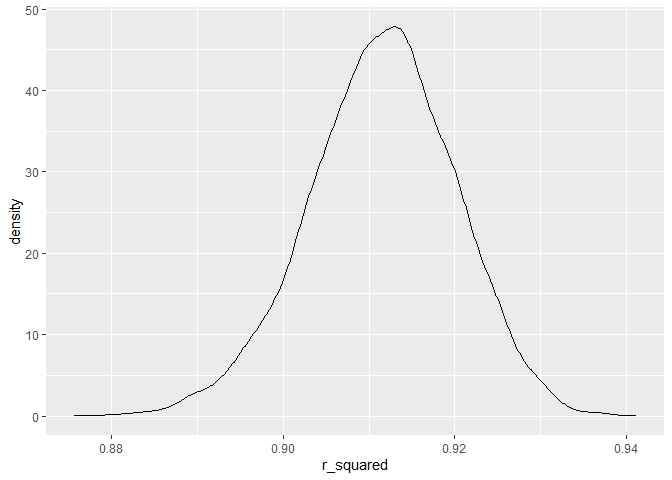
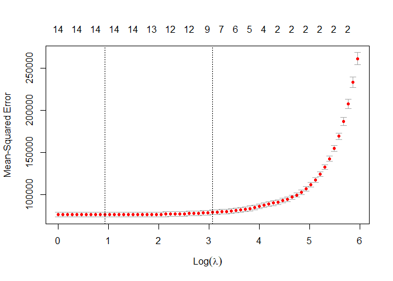
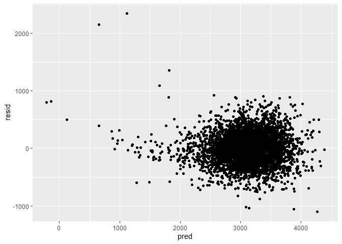

Homework 6
================
Mari Sanders
2024-12-02

# Problem 1

``` r
weather_df = 
  rnoaa::meteo_pull_monitors(
    c("USW00094728"),
    var = c("PRCP", "TMIN", "TMAX"), 
    date_min = "2017-01-01",
    date_max = "2017-12-31") %>%
  mutate(
    name = recode(id, USW00094728 = "CentralPark_NY"),
    tmin = tmin / 10,
    tmax = tmax / 10) %>%
  select(name, id, everything())
```

    ## using cached file: C:\Users\marsi\AppData\Local/R/cache/R/rnoaa/noaa_ghcnd/USW00094728.dly

    ## date created (size, mb): 2024-09-26 10:18:58.392981 (8.668)

    ## file min/max dates: 1869-01-01 / 2024-09-30

``` r
betas <- function(lm) {
    broom::tidy(lm) %>% 
    pull(estimate) %>% 
    prod %>% log()
}
r_squareds <- function(lm) {
  broom::glance(lm) %>% 
    pull(r.squared) 
}

boots <- 
  weather_df %>% 
  bootstrap(n = 5000) %>% 
  mutate(
    models = map(strap, ~lm(tmax~tmin, data = .)), 
    log_betas = map(models, betas), 
    r_squared = map(models, r_squareds)
  )

r_squared_betas <- 
  boots %>% 
  unnest(log_betas:r_squared) %>% 
  select(-strap)

r_squared_betas %>% pull(log_betas) %>% 
  quantile(probs = c(0.025, 0.975))
```

    ##     2.5%    97.5% 
    ## 1.964572 2.059126

``` r
r_squared_betas %>% pull(r_squared) %>% 
  quantile(probs = c(0.025, 0.975))
```

    ##      2.5%     97.5% 
    ## 0.8938410 0.9275271

``` r
ggplot(r_squared_betas, aes(x = log_betas)) + geom_density()
```

<!-- -->

``` r
ggplot(r_squared_betas, aes(x = r_squared)) + geom_density()
```

<!-- -->

# Problem 2

Data Cleaning

``` r
homicide_df <- read_csv("data/homicide-data.csv", na = c("", "NA", "Unknown")) %>% 
  filter(victim_race != "NA") %>% 
  janitor::clean_names() %>% 
  unite(city_state, c(city, state), sep = ", ") %>% 
  filter(city_state != "Dallas, TX", 
         city_state != "Phoenix, AZ", 
         city_state != "Kansas City, MO", 
         city_state != "Tulsa, AL",
         victim_race %in% c("White", "Black"),
         victim_age != "Unknown"
  ) %>%
  mutate(victim_age = as.numeric(victim_age), 
           resolved = as.numeric(disposition == "Closed by arrest"), 
        victim_race = fct_relevel(victim_race, "White")) %>% 
  select(city_state, resolved, victim_age, victim_race, victim_sex) 
```

    ## Rows: 52179 Columns: 12
    ## ── Column specification ────────────────────────────────────────────────────────
    ## Delimiter: ","
    ## chr (8): uid, victim_last, victim_first, victim_race, victim_sex, city, stat...
    ## dbl (4): reported_date, victim_age, lat, lon
    ## 
    ## ℹ Use `spec()` to retrieve the full column specification for this data.
    ## ℹ Specify the column types or set `show_col_types = FALSE` to quiet this message.

Baltimore

``` r
logistic <- 
  homicide_df %>% 
  filter(city_state == "Baltimore, MD") %>% 
  glm(resolved ~ victim_age + victim_sex + victim_race, data = ., family = binomial())

broom::tidy(logistic, conf.int = TRUE) %>% 
  mutate(OR = exp(estimate), 
         conf_low = exp(conf.low), 
         conf_high = exp(conf.high)) %>% 
  select(term, log_OR = estimate, OR, conf_low, conf_high) %>% 
  filter(term == "victim_sexMale") %>% 
  knitr::kable(digits = 3)
```

| term           | log_OR |    OR | conf_low | conf_high |
|:---------------|-------:|------:|---------:|----------:|
| victim_sexMale | -0.854 | 0.426 |    0.324 |     0.558 |

In Baltimore, homicides of male victims were 0.426 times more likely to
be unsolved compared to homicides of female victims after adjusting for
all other variables.

``` r
city_results <- homicide_df %>%
  group_by(city_state) %>%
  nest() %>%
  mutate(
    model = map(data, ~glm(resolved ~ victim_age + victim_sex + victim_race, data = ., family = "binomial")),
    results = map(model, broom::tidy, conf.int = TRUE)) %>%
  unnest(results) %>%
  mutate(OR = exp(estimate), 
         conf_low = exp(conf.low), 
         conf_high = exp(conf.high)) %>% 
  select(city_state, term, OR, conf_low, conf_high) %>%
   filter(term == "victim_sexMale") 

city_results %>% knitr::kable(digits = 3)
```

| city_state         | term           |    OR | conf_low | conf_high |
|:-------------------|:---------------|------:|---------:|----------:|
| Albuquerque, NM    | victim_sexMale | 1.767 |    0.825 |     3.762 |
| Atlanta, GA        | victim_sexMale | 1.000 |    0.680 |     1.458 |
| Baltimore, MD      | victim_sexMale | 0.426 |    0.324 |     0.558 |
| Baton Rouge, LA    | victim_sexMale | 0.381 |    0.204 |     0.684 |
| Birmingham, AL     | victim_sexMale | 0.870 |    0.571 |     1.314 |
| Boston, MA         | victim_sexMale | 0.667 |    0.351 |     1.260 |
| Buffalo, NY        | victim_sexMale | 0.521 |    0.288 |     0.936 |
| Charlotte, NC      | victim_sexMale | 0.884 |    0.551 |     1.391 |
| Chicago, IL        | victim_sexMale | 0.410 |    0.336 |     0.501 |
| Cincinnati, OH     | victim_sexMale | 0.400 |    0.231 |     0.667 |
| Columbus, OH       | victim_sexMale | 0.532 |    0.377 |     0.748 |
| Denver, CO         | victim_sexMale | 0.479 |    0.233 |     0.962 |
| Detroit, MI        | victim_sexMale | 0.582 |    0.462 |     0.734 |
| Durham, NC         | victim_sexMale | 0.812 |    0.382 |     1.658 |
| Fort Worth, TX     | victim_sexMale | 0.669 |    0.394 |     1.121 |
| Fresno, CA         | victim_sexMale | 1.335 |    0.567 |     3.048 |
| Houston, TX        | victim_sexMale | 0.711 |    0.557 |     0.906 |
| Indianapolis, IN   | victim_sexMale | 0.919 |    0.678 |     1.241 |
| Jacksonville, FL   | victim_sexMale | 0.720 |    0.536 |     0.965 |
| Las Vegas, NV      | victim_sexMale | 0.837 |    0.606 |     1.151 |
| Long Beach, CA     | victim_sexMale | 0.410 |    0.143 |     1.024 |
| Los Angeles, CA    | victim_sexMale | 0.662 |    0.457 |     0.954 |
| Louisville, KY     | victim_sexMale | 0.491 |    0.301 |     0.784 |
| Memphis, TN        | victim_sexMale | 0.723 |    0.526 |     0.984 |
| Miami, FL          | victim_sexMale | 0.515 |    0.304 |     0.873 |
| Milwaukee, wI      | victim_sexMale | 0.727 |    0.495 |     1.054 |
| Minneapolis, MN    | victim_sexMale | 0.947 |    0.476 |     1.881 |
| Nashville, TN      | victim_sexMale | 1.034 |    0.681 |     1.556 |
| New Orleans, LA    | victim_sexMale | 0.585 |    0.422 |     0.812 |
| New York, NY       | victim_sexMale | 0.262 |    0.133 |     0.485 |
| Oakland, CA        | victim_sexMale | 0.563 |    0.364 |     0.867 |
| Oklahoma City, OK  | victim_sexMale | 0.974 |    0.623 |     1.520 |
| Omaha, NE          | victim_sexMale | 0.382 |    0.199 |     0.711 |
| Philadelphia, PA   | victim_sexMale | 0.496 |    0.376 |     0.650 |
| Pittsburgh, PA     | victim_sexMale | 0.431 |    0.263 |     0.696 |
| Richmond, VA       | victim_sexMale | 1.006 |    0.483 |     1.994 |
| San Antonio, TX    | victim_sexMale | 0.705 |    0.393 |     1.238 |
| Sacramento, CA     | victim_sexMale | 0.669 |    0.326 |     1.314 |
| Savannah, GA       | victim_sexMale | 0.867 |    0.419 |     1.780 |
| San Bernardino, CA | victim_sexMale | 0.500 |    0.166 |     1.462 |
| San Diego, CA      | victim_sexMale | 0.413 |    0.191 |     0.830 |
| San Francisco, CA  | victim_sexMale | 0.608 |    0.312 |     1.155 |
| St. Louis, MO      | victim_sexMale | 0.703 |    0.530 |     0.932 |
| Stockton, CA       | victim_sexMale | 1.352 |    0.626 |     2.994 |
| Tampa, FL          | victim_sexMale | 0.808 |    0.340 |     1.860 |
| Tulsa, OK          | victim_sexMale | 0.976 |    0.609 |     1.544 |
| Washington, DC     | victim_sexMale | 0.691 |    0.466 |     1.014 |

``` r
city_results %>% 
  ggplot(aes(x = fct_reorder(city_state, OR), y = OR)) + 
  geom_point() +
  geom_errorbar(aes(ymin = conf_low, ymax = conf_high)) +
  labs(
    title = "Solved homicides, Male vs. Female Victims",
    x = "City", 
    y = "Adjusted Odds Ratio"
  ) +
  theme(axis.text.x = element_text(angle = 90, vjust = 0.5, hjust = 1))
```

<!-- -->

All of the cities, except for Tulsa, Atlanta, Richmond, Nashville,
Fresno, Stockton, and Albuquerque have an adjusted odds ratio less
than 1. This means that males in all cities except for these are more
likely to have unsolved homicides than females.

# Problem 3

``` r
birthweight <- read_csv("data/birthweight.csv") %>% 
  mutate(babysex = as.factor(babysex), 
         frace = as.factor(frace), 
         mrace = as.factor(mrace), 
         malform = as.factor(malform))
```

    ## Rows: 4342 Columns: 20
    ## ── Column specification ────────────────────────────────────────────────────────
    ## Delimiter: ","
    ## dbl (20): babysex, bhead, blength, bwt, delwt, fincome, frace, gaweeks, malf...
    ## 
    ## ℹ Use `spec()` to retrieve the full column specification for this data.
    ## ℹ Specify the column types or set `show_col_types = FALSE` to quiet this message.

``` r
birthweight %>% 
  is.na() %>% 
  summary()
```

    ##   babysex          bhead          blength           bwt         
    ##  Mode :logical   Mode :logical   Mode :logical   Mode :logical  
    ##  FALSE:4342      FALSE:4342      FALSE:4342      FALSE:4342     
    ##    delwt          fincome          frace          gaweeks       
    ##  Mode :logical   Mode :logical   Mode :logical   Mode :logical  
    ##  FALSE:4342      FALSE:4342      FALSE:4342      FALSE:4342     
    ##   malform         menarche        mheight          momage       
    ##  Mode :logical   Mode :logical   Mode :logical   Mode :logical  
    ##  FALSE:4342      FALSE:4342      FALSE:4342      FALSE:4342     
    ##    mrace           parity         pnumlbw         pnumsga       
    ##  Mode :logical   Mode :logical   Mode :logical   Mode :logical  
    ##  FALSE:4342      FALSE:4342      FALSE:4342      FALSE:4342     
    ##    ppbmi            ppwt           smoken          wtgain       
    ##  Mode :logical   Mode :logical   Mode :logical   Mode :logical  
    ##  FALSE:4342      FALSE:4342      FALSE:4342      FALSE:4342

There are no missing values in this dataset.

``` r
x <- birthweight %>% 
  select(-bwt) %>% data.matrix()
y <- birthweight %>% 
  select(bwt) %>% pull()
cv_model <- cv.glmnet(x,y, alpha = 1)
best_lambda <- cv_model$lambda.min
plot(cv_model)
```

<!-- -->

``` r
best_model <- glmnet(x, y, alpha = 1, lambda = best_lambda)
coef(best_model)
```

    ## 20 x 1 sparse Matrix of class "dgCMatrix"
    ##                        s0
    ## (Intercept) -6159.0454264
    ## babysex        26.7837191
    ## bhead         133.7823509
    ## blength        76.2335342
    ## delwt           1.1321579
    ## fincome         0.6039174
    ## frace         -10.7669487
    ## gaweeks        11.6394672
    ## malform         .        
    ## menarche       -2.2764510
    ## mheight         4.7238901
    ## momage          2.8739417
    ## mrace         -41.7053780
    ## parity         65.1187493
    ## pnumlbw         .        
    ## pnumsga         .        
    ## ppbmi           .        
    ## ppwt            .        
    ## smoken         -3.3140939
    ## wtgain          2.6324389

Used lasso to find the most important coefficients

``` r
birthweight_model_adjusted <- 
  lm(bwt~ babysex + bhead + blength + delwt  + fincome + frace + gaweeks + menarche + mheight + momage + mrace + parity + smoken + wtgain, data = birthweight)
summary(birthweight_model_adjusted)
```

    ## 
    ## Call:
    ## lm(formula = bwt ~ babysex + bhead + blength + delwt + fincome + 
    ##     frace + gaweeks + menarche + mheight + momage + mrace + parity + 
    ##     smoken + wtgain, data = birthweight)
    ## 
    ## Residuals:
    ##      Min       1Q   Median       3Q      Max 
    ## -1096.18  -184.97    -3.28   173.37  2343.93 
    ## 
    ## Coefficients:
    ##               Estimate Std. Error t value Pr(>|t|)    
    ## (Intercept) -6076.3394   140.3380 -43.298  < 2e-16 ***
    ## babysex2       28.6687     8.4621   3.388 0.000711 ***
    ## bhead         130.8115     3.4500  37.917  < 2e-16 ***
    ## blength        74.9520     2.0209  37.088  < 2e-16 ***
    ## delwt           1.3812     0.2363   5.846 5.41e-09 ***
    ## fincome         0.2903     0.1794   1.618 0.105779    
    ## frace2         14.4462    46.1368   0.313 0.754207    
    ## frace3         21.0968    69.2793   0.305 0.760748    
    ## frace4        -47.1129    44.6669  -1.055 0.291594    
    ## frace8          4.5682    74.0476   0.062 0.950810    
    ## gaweeks        11.5439     1.4649   7.880 4.11e-15 ***
    ## menarche       -3.5779     2.8932  -1.237 0.216280    
    ## mheight         6.8160     1.8003   3.786 0.000155 ***
    ## momage          0.7699     1.2214   0.630 0.528491    
    ## mrace2       -151.5475    46.0336  -3.292 0.001002 ** 
    ## mrace3        -92.0031    71.8741  -1.280 0.200593    
    ## mrace4        -56.6313    45.1245  -1.255 0.209546    
    ## parity         95.3411    40.4655   2.356 0.018512 *  
    ## smoken         -4.8542     0.5867  -8.273  < 2e-16 ***
    ## wtgain          2.7202     0.4327   6.286 3.58e-10 ***
    ## ---
    ## Signif. codes:  0 '***' 0.001 '**' 0.01 '*' 0.05 '.' 0.1 ' ' 1
    ## 
    ## Residual standard error: 272.4 on 4322 degrees of freedom
    ## Multiple R-squared:  0.7183, Adjusted R-squared:  0.7171 
    ## F-statistic: 580.1 on 19 and 4322 DF,  p-value: < 2.2e-16

``` r
birthweight %>%
  add_predictions(birthweight_model_adjusted) %>%
  add_residuals(birthweight_model_adjusted) %>% 
  ggplot(aes(x = pred, y = resid)) + 
  geom_point() 
```

<!-- -->

``` r
main_effects <- 
  lm(bwt ~ blength + gaweeks, data = birthweight)

interactions <- 
  lm(bwt ~bhead + blength + babysex + bhead*blength*babysex, data = birthweight)
```

``` r
cv_df <- 
  crossv_mc(birthweight, 100) %>% 
  mutate(
    train = map(train, as_tibble), 
    test = map(test, as_tibble)
  ) %>% 
  mutate(my_model = map(train, \(df) lm(bwt~ babysex + bhead + blength + delwt  + fincome + frace + gaweeks + menarche + mheight + momage + mrace + parity + smoken + wtgain, data = df)),
    main_effects = map(train, \(df) lm(bwt ~ blength, gaweeks, data = df)), 
         interactions = map(train, \(df) lm(bwt ~bhead + blength + babysex + bhead*blength*babysex, data = df))) %>% 
  mutate(
    rmse_mymodel = map2_dbl(my_model, test, \(mod, df) rmse(model = mod, data = df)), 
    rmse_maineffects = map2_dbl(main_effects, test, \(mod, df) rmse(model = mod, data = df)), 
    rmse_interactions = map2_dbl(interactions, test, \(mod, df) rmse(model = mod, data = df))
  )
```

    ## Warning: There was 1 warning in `mutate()`.
    ## ℹ In argument: `rmse_mymodel = map2_dbl(...)`.
    ## Caused by warning in `predict.lm()`:
    ## ! prediction from rank-deficient fit; attr(*, "non-estim") has doubtful cases

``` r
cv_df %>% 
  select(starts_with("rmse")) %>% 
  pivot_longer(everything(), 
               names_to = "model", 
               values_to = "rmse", 
               names_prefix = "rmse_") %>% 
  mutate(model = fct_inorder(model)) %>% 
  ggplot(aes(x = model, y = rmse)) +
  geom_violin()
```

<!-- -->
